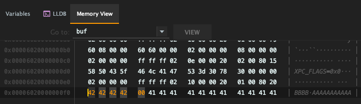
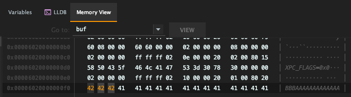
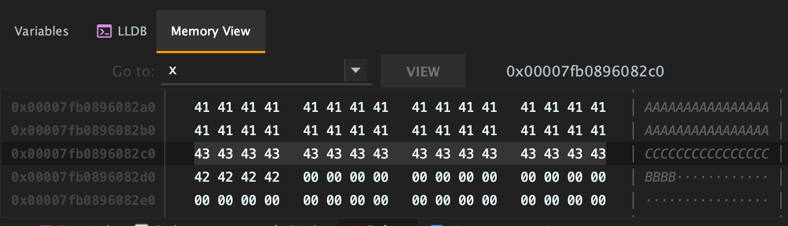
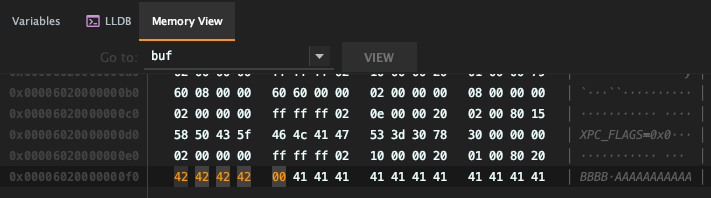

# Security Complications from Various Null Byte Terminator Behaviors for String Copying

This shows how some string copying functions behave for the null byte terminator, and how it could be a security issue for you. First we have a test buffer that is 16 bytes filled with 'A', and then we will only write a few bytes with each string copying function, watch the null byte. It could be appended, replacing something, or none at all. Remembering this may save you from something catastrophic.

## The Test Buffer

```c
int size = 16;
char* buf = (char*) malloc(size);
memset(buf, 'A', size);
```

## strcpy() Example

<u>Code example</u>:

```c
strcpy(buf, "BBBB");
```

<u>Results</u>:

This function will **append an extra null byte at the end**. So for the above example, even though we are copying 4 bytes, there is a 5th byte that is null.



<u>Why so dangerous</u>:

Technically this would be an off-by-one error causing a buffer overflow if the malloc is based on a strlen. The actual impact may vary depending on where the null byte writes to. It is likely a denial-of-service at best, or possibly no crash at all. In some perfect scenarios maybe this could overwrite a flag or a pointer in a structure.

```c
#define INPUT "AAAA"
char* buf = (char*) malloc(strlen(INPUT)); // strlen() returns 4
strcpy(buf, INPUT);                        // Will copy 5 bytes, overflow
```

## strncpy() Example

<u>Code example</u>:

```c
strncpy(buf, "BBBB", 3);
```

<u>Results</u>:

This function **will not add a null byte terminator at all**.



<u>Why so dangerous</u>:

Since there is no null byte in the buffer, it could cause an information leak that allows the user to read extra data from memory. For example:

```c
// To demonstrate the problem, this is my attempt to create this memory layout
// to make sure the buffer we want to print is placed right before another buffer,
// like so:
// [ Buffer A: Buffer to print ][ Buffer B: Something with data ]
// Not exactly great heap feng shui, but actually did the trick for me on my laptop.
// Your experience may be different.

// Making a lot of "buffer As", and we'll only print the last one.
void* x = nullptr;
for (int i=0; i < 1024; i++) {
    x = malloc(16);
    memset(x, 'A', 16);
}

// This is the "Buffer B"
char* buf = (char*) malloc(4);
memset(buf, 'B', 4);

// For buffer A, we want to rewrite the 16 bytes with 'C' using strncpy
strncpy((char*) x, "CCCCCCCCCCCCCCCC", 16);

// When we print buffer A, it may actually print more than 16 bytes
// because buffer A has no null byte terminator (thanks strncpy),
// and buffer B happens to be right next to it.
printf("%s\n", x);
```

Some proof to the above exampe:



## sprintf() Example

<u>Code example</u>:

```c
sprintf(buf, "%s", "BBBB");
```

<u>Results</u>:

This function will **append an extra null byte at the end**, similar to strcpy:



<u>Why so dangerous</u>:

Similar to strcpy, this is technically a buffer overflow.

## snprintf() Example

<u>Code example</u>:

```c
snprintf(buf, 4, "%s", "BBBB");
```

<u>Results</u>:

This function will **replace the last byte with null**. In this case, we want to write 4 Bs, but we end up only with 3 because the last one is overwritten with a null byte.


<u>Why so dangerous</u>:

This is technically data corruption. The impact really depends on the application, but one scenario I could think of is copying a verification code for authentication purposes, which often would be a four-digit code, and copying one byte less makes it much less secure and more brute-forceable.

